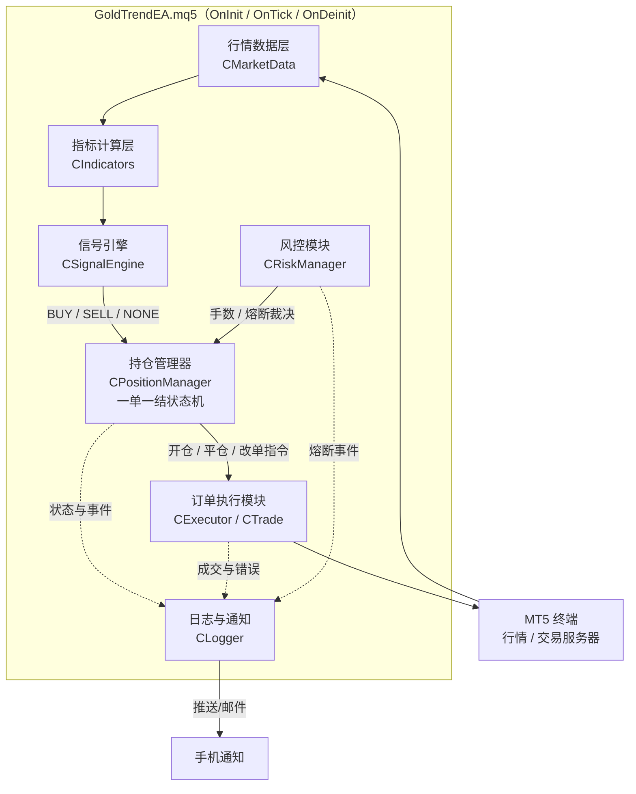
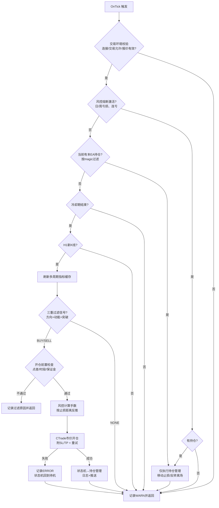
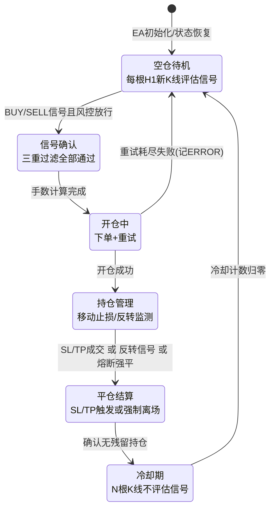
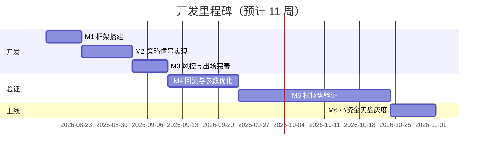

# 黄金外汇 EA「顺势一单一结」开发方案

> 版本：v1.1　|　目标平台：MetaTrader 5（MQL5）　|　主交易品种：XAUUSD（黄金/美元）
> 文档性质：完整开发方案，可直接指导后续 EA 编码、回测与上线。

---

## 目录

1. [项目概述与目标](#1-项目概述与目标)
2. [需求分析](#2-需求分析)
3. [技术选型与系统架构](#3-技术选型与系统架构)
4. [策略逻辑详细设计（核心）](#4-策略逻辑详细设计核心)
5. [资金管理与风控设计](#5-资金管理与风控设计)
6. [关键实现要点（MQL5）](#6-关键实现要点mql5)
7. [回测与参数优化计划](#7-回测与参数优化计划)
8. [部署与运维](#8-部署与运维)
9. [开发计划与里程碑](#9-开发计划与里程碑)
10. [代码审查与优化计划（基于 v0.10 审查结论）](#10-代码审查与优化计划基于-v010-审查结论)
11. [风险声明与注意事项](#11-风险声明与注意事项)

---

## 1. 项目概述与目标

### 1.1 项目背景

黄金（XAUUSD）是波动率高、趋势性强的品种，日内波动常达 150~400 点（以 0.01 报价点计），既提供了充足的趋势利润空间，也带来了剧烈的回撤风险。市面上大量黄金 EA 依赖马丁、网格等逆势加仓策略，短期曲线平滑但存在爆仓尾部风险。

本项目反其道而行：开发一款**顺势交易、一单一结、严格风控**的 EA，追求的不是"永不亏损"，而是**单笔风险严格可控、长期正期望**的稳健曲线。

### 1.2 核心理念

| 理念 | 说明 |
| --- | --- |
| **顺势** | 只在多周期趋势方向确立后顺势进场，绝不逆势抄底摸顶、不做震荡区间反转 |
| **一单一结** | 同一时间市场中最多持有 1 张订单，平仓结算后才允许开下一单；**绝不加仓、不马丁、不网格** |
| **严格风控** | 每单入场即带止损；单笔风险按账户百分比反推手数；日/周亏损熔断；连亏暂停 |
| **可验证** | 全部逻辑基于收盘 K 线与标准指标，可在 MT5 策略测试器中用真实 Tick 数据完整复现 |

### 1.3 目标品种与周期

- **主品种**：XAUUSD（黄金）
- **可扩展品种**：EURUSD、GBPUSD、USDJPY 等主流直盘（策略参数按品种独立优化，代码层面品种无关）
- **分析周期**：H4（趋势方向）+ H1（趋势确认/入场）+ M15（可选精细入场，默认关闭）

### 1.4 成功标准（验收指标）

| 指标 | 目标值 | 说明 |
| --- | --- | --- |
| 回测利润因子（Profit Factor） | ≥ 1.5 | 5 年真实 Tick 回测 |
| 最大相对回撤 | ≤ 20% | 按净值计算 |
| 单笔最大亏损 | ≤ 1.5% 账户净值 | 含滑点后的实际值 |
| 样本外表现衰减 | ≤ 30% | walk-forward 样本外 PF 相对样本内的衰减幅度 |
| 模拟盘与回测偏差 | 交易信号一致率 ≥ 95% | 3 个月模拟盘对照 |
| 稳定性 | 7×24 无人值守运行无崩溃、无孤儿单 | VPS 环境 |

---

## 2. 需求分析

### 2.1 功能性需求

| 编号 | 需求 | 描述 | 优先级 |
| --- | --- | --- | --- |
| F01 | 趋势信号识别 | 基于 H4/H1 EMA 排列 + ADX 强度 + MACD 动能 + 唐奇安突破的多重过滤信号引擎 | P0 |
| F02 | 自动开仓 | 信号确认后按风控手数市价开仓，附带初始 SL/TP | P0 |
| F03 | 一单一结持仓管控 | 按 magic number 检测持仓，有持仓时禁止任何新开仓；平仓后进入可配置冷却期 | P0 |
| F04 | 止损止盈 | 基于 ATR 或结构点的初始止损；固定盈亏比止盈 | P0 |
| F05 | 移动止损 | 保本推损 + ATR 跟踪止损，二选一或组合启用 | P0 |
| F06 | 趋势反转离场 | 出现反向趋势确认信号时强制市价离场，不等待止损/止盈 | P1 |
| F07 | 风控熔断 | 日/周最大亏损停机、最大连亏暂停、点差过滤、时段过滤 | P0 |
| F08 | 日志系统 | 分级日志（INFO/WARN/ERROR），记录信号、下单、修改、平仓、异常全链路 | P0 |
| F09 | 通知推送 | 开平仓、熔断触发等关键事件通过 MT5 手机推送 / 邮件通知 | P1 |
| F10 | 参数外置 | 全部策略与风控参数通过 input 变量外置，可在测试器中优化 | P0 |
| F11 | 图表面板（可选） | 图表上显示当前状态机状态、趋势方向、当日盈亏、熔断状态 | P2 |

### 2.2 非功能性需求

| 编号 | 需求 | 描述 |
| --- | --- | --- |
| N01 | 稳定性 | OnTick 内无阻塞操作；异常分支全部捕获记录；重启后能从现有持仓恢复状态 |
| N02 | 滑点与重报处理 | 下单设置最大偏差点数；requote/常见错误码自动退避重试（有限次数） |
| N03 | 可回测可优化 | 逻辑基于**已收盘 K 线**计算，杜绝未来函数；指标经句柄+CopyBuffer 获取，测试器/实盘行为一致 |
| N04 | 可配置性 | 品种、周期、指标参数、风控阈值全部可配置；同一 EA 可挂多品种图表（magic 区分） |
| N05 | 性能 | 仅在新 K 线出现时执行完整信号计算；Tick 级别只做移动止损与熔断检查 |
| N06 | 兼容性 | 兼容对冲（Hedging）与净持仓（Netting）两种账户模式；自动适配报价小数位（3/5 位与黄金 2/3 位） |

---

## 3. 技术选型与系统架构

### 3.1 选型理由：MT5 + MQL5

| 维度 | 说明 |
| --- | --- |
| 回测质量 | MT5 策略测试器支持**真实 Tick 数据**回测与多线程遗传算法优化，远优于 MT4 |
| 语言能力 | MQL5 为类 C++ 语言，支持类/继承，便于模块化架构；标准库提供 `CTrade`、`CPositionInfo` 等成熟封装 |
| 生态 | 主流黄金券商均提供 MT5；VPS、推送通知、报表工具链完善 |
| 风险点 | Netting 账户模式下持仓语义不同，需在持仓管理器中做模式适配（见 6.6） |

### 3.2 EA 内部模块划分

| 模块 | 类名（建议） | 职责 |
| --- | --- | --- |
| 行情数据层 | `CMarketData` | 新 K 线判定、多周期 OHLC 读取、点差/报价有效性检查 |
| 指标计算层 | `CIndicators` | 统一管理 EMA/ADX/MACD/ATR/Donchian 指标句柄，缓存 CopyBuffer 结果 |
| 信号引擎 | `CSignalEngine` | 三重过滤逻辑：趋势方向 + 动能确认 + 突破触发，输出 BUY/SELL/NONE |
| 持仓管理器 | `CPositionManager` | **一单一结状态机**核心：按 magic 统计持仓、状态流转、冷却期计数 |
| 风控模块 | `CRiskManager` | 手数计算、日/周亏损熔断、连亏暂停、点差/时段过滤 |
| 订单执行模块 | `CExecutor` | 封装 `CTrade`：市价开平仓、SL/TP 修改、错误码处理与重试 |
| 日志与通知 | `CLogger` | 分级日志写文件 + Print；关键事件 SendNotification/SendMail |

### 3.3 模块关系架构图



### 3.4 OnTick 主流程图



> 设计要点：完整信号计算只在 **H1 新 K 线** 出现时执行一次；移动止损与熔断检查在每个 Tick 上以轻量方式执行，兼顾响应速度与性能。

---

## 4. 策略逻辑详细设计（核心）

策略采用「**方向（EMA 排列）→ 强度（ADX）→ 动能（MACD）→ 触发（唐奇安突破）**」四层递进的三重过滤结构（ADX 归入方向层的强度确认），所有条件基于**已收盘 K 线**判定，杜绝未来函数与盘中反复。

### 4.1 趋势方向判定（H4 定方向 + H1 确认）

**指标**：EMA20 / EMA60 / EMA200（收盘价），ADX(14)。

**多头趋势成立**（同时满足）：

1. H4：`EMA20 > EMA60 > EMA200`（多头排列），且收盘价位于 EMA20 上方；
2. H1：`EMA20 > EMA60`（H1 与 H4 方向一致，避免大周期趋势中的深度回调期入场）；
3. H4 的 `ADX(14) > ADX_Threshold`（默认 **22**，优化区间 18~30）——过滤震荡市。

**空头趋势成立**：以上条件全部镜像（空头排列、收盘价在 EMA20 下方、H1 空头一致、ADX 同阈值）。

**震荡/不明**：不满足上述任一方向 → 输出 NONE，不交易。

> 选择理由：
> - EMA20/60/200 分别对应短、中、长期成本线，三线排列是最经典且回测稳健的方向过滤器；60 而非 50 是为了与 20 保持 3 倍关系、减少参数冗余。
> - ADX 只用于衡量**趋势强度**而非方向，阈值 22 在黄金 H4 上能过滤掉大部分横盘期；阈值过高（>30）会漏掉趋势初段。
> - 可选增强：要求 ADX 当前值 > 前一根值（趋势强度递增），默认关闭，留作优化开关。

### 4.2 入场触发（H1 上动能 + 突破双确认）

在趋势方向成立的前提下，H1 收盘后检查以下两个触发条件，**全部满足才开仓**：

**（1）MACD 动能确认**（MACD 12/26/9，H1）：

- 做多：MACD 主线在**最近 N_macd 根 K 线内**（默认 3 根）发生金叉（主线上穿信号线），且当前主线 > 信号线；主线位置不作硬性要求，但可选开关"金叉发生在零轴下方附近或上方"用于优化。
- 做空：镜像（近 3 根内死叉且主线 < 信号线）。

**（2）唐奇安通道突破**（20 周期，H1，不含当前 K 线）：

- 做多：当前 K 线**收盘价** > 前 20 根 K 线最高价（`Donchian_Upper`）；
- 做空：当前 K 线收盘价 < 前 20 根 K 线最低价（`Donchian_Lower`）。

> 选择理由与关键决策：
> - **用收盘价确认突破而非盘中触及**：黄金假突破极多，收盘确认牺牲少量入场价格换取显著更高的信号质量，且保证回测/实盘一致。
> - **MACD 用"近 3 根内发生交叉"而非"当根交叉"**：突破与动能交叉往往不在同一根 K 线上发生，允许小窗口错位可避免漏掉大量有效信号，同时窗口足够小以保证动能新鲜。
> - **触发顺序不敏感**：只要在同一根收盘 K 线上"方向成立 + 动能在窗口内 + 收盘突破"三者同时为真即开仓，实现简单、无路径依赖。
> - M15 精细入场（在 H1 信号成立后等 M15 回踩再进）作为 P2 可选功能，默认关闭——增加复杂度且回测收益提升有限。

**入场条件汇总（做多）**：

```text
H4: EMA20>EMA60>EMA200 且 Close>EMA20 且 ADX(14)>22
H1: EMA20>EMA60
H1: 近3根内MACD金叉 且 当前主线>信号线
H1: 收盘价 > 前20根最高价（唐奇安上轨）
持仓管理器: 当前无持仓 且 冷却期已过 且 熔断未触发
```

### 4.3 一单一结机制（状态机）

**核心不变量**：任意时刻，`magic number == InpMagic` 的持仓数量 ≤ 1；持仓数量 > 0 时，信号引擎的任何输出都被持仓管理器丢弃。



实现要点：

- **持仓检测为唯一事实来源**：状态机每次流转前都用 `PositionsTotal()` 遍历 + magic/symbol 过滤重新核对真实持仓，而非只信任内存状态——防止手动平仓、SL 触发、断线期间成交导致的状态漂移。
- **EA 重启恢复**：`OnInit` 中检测到本 magic 已有持仓 → 直接进入 MANAGING；无持仓 → 读取全局变量（`GlobalVariableGet`）中保存的冷却截止时间，决定进入 COOLDOWN 还是 IDLE。
- **冷却期**：平仓后冷却 `InpCooldownBars` 根 H1 K 线（默认 **3**，优化区间 0~10）。目的：避免止损后立刻被同一信号再次触发、连续挨打；亏损平仓与盈利平仓可配置不同冷却长度（默认相同）。
- **平仓事件识别**：通过 `OnTradeTransaction` 捕获 `TRADE_TRANSACTION_DEAL_ADD` 且 `DEAL_ENTRY_OUT` 的成交，据此记录单笔盈亏（供连亏计数与日亏熔断）并启动冷却计时。

### 4.4 出场规则

| 出场方式 | 规则 | 默认参数 |
| --- | --- | --- |
| 初始止损 | `SL = 入场价 ∓ max(ATR(14,H1) × InpSL_ATR_Mult, 结构点距离)`；结构点 = 近 `InpSwingBars`(10) 根 K 线的最低/最高点外加缓冲 | ATR 倍数 **2.0**（优化 1.5~3.0） |
| 固定止盈 | `TP = 入场价 ± 止损距离 × InpRR`，盈亏比默认 **1:1.8** | RR 优化 1.2~2.5 |
| 保本推损 | 浮盈达到 `止损距离 × InpBE_Trigger`(1.0) 时，SL 移至 `入场价 ± InpBE_Offset`(黄金 0.3 美元) | 默认启用 |
| ATR 移动止损 | 保本后启动：每根 H1 新 K 线，`SL = 当前收盘价 ∓ ATR(14) × InpTrail_ATR_Mult`(2.5)，只朝有利方向移动 | 默认启用 |
| 趋势反转强制离场 | H4 EMA 排列反转（EMA20 与 EMA60 反向交叉）**或** H1 出现完整反向三重信号 → 市价离场 | 默认启用 |
| 周五离场（可选） | 周五服务器时间 ≥ `InpFridayCloseHour`(21:00) 强制平仓且不再开仓，规避周末跳空 | 默认启用（黄金跳空风险高） |

> 关键决策：**止盈与移动止损并存**——固定 TP 锁定基准盈亏比，ATR 跟踪在强趋势中让利润奔跑（若跟踪 SL 先于 TP 上移越过原 TP 语义，采用"启用跟踪后取消固定 TP"的可选模式 `InpTrailReplacesTP`，默认关闭，作为优化开关对比两种风格）。

### 4.5 可调参数总表

| 参数名 | 含义 | 建议默认值 | 优化范围 |
| --- | --- | --- | --- |
| `InpMagic` | EA 魔术号 | 20260813 | 不优化 |
| `InpTrendTF` | 趋势周期 | H4 | 不优化（固定） |
| `InpSignalTF` | 信号周期 | H1 | 不优化（固定） |
| `InpEMA_Fast` | 快线周期 | 20 | 10~30 步长5 |
| `InpEMA_Mid` | 中线周期 | 60 | 40~80 步长10 |
| `InpEMA_Slow` | 慢线周期 | 200 | 150~250 步长25 |
| `InpADX_Period` | ADX 周期 | 14 | 不优化 |
| `InpADX_Threshold` | ADX 趋势阈值 | 22 | 18~30 步长2 |
| `InpADX_Rising` | 要求 ADX 递增 | false | true/false |
| `InpMACD_Fast/Slow/Signal` | MACD 参数 | 12/26/9 | 不优化（标准值） |
| `InpMACD_Window` | 交叉回溯窗口(根) | 3 | 1~5 步长1 |
| `InpDonchian_Period` | 唐奇安周期 | 20 | 10~40 步长5 |
| `InpATR_Period` | ATR 周期 | 14 | 不优化 |
| `InpSL_ATR_Mult` | 止损 ATR 倍数 | 2.0 | 1.5~3.0 步长0.25 |
| `InpSwingBars` | 结构点回溯根数 | 10 | 5~20 步长5 |
| `InpRR` | 盈亏比 | 1.8 | 1.2~2.5 步长0.2 |
| `InpBE_Trigger` | 保本触发(倍SL距离) | 1.0 | 0.6~1.5 步长0.2 |
| `InpBE_Offset` | 保本偏移(美元) | 0.3 | 0~1.0 |
| `InpTrail_ATR_Mult` | 跟踪止损 ATR 倍数 | 2.5 | 1.5~3.5 步长0.5 |
| `InpTrailReplacesTP` | 跟踪启动后取消TP | false | true/false |
| `InpCooldownBars` | 冷却 K 线数(H1) | 3 | 0~10 步长1 |
| `InpRiskPercent` | 单笔风险 % | 1.0 | 0.5~2.0（实盘固定≤1） |
| `InpMaxLots` | 最大手数上限 | 1.0 | 按账户规模定 |
| `InpDailyLossPct` | 日亏损熔断 % | 3.0 | 不优化（风控红线） |
| `InpWeeklyLossPct` | 周亏损熔断 % | 6.0 | 不优化（风控红线） |
| `InpMaxConsecLoss` | 最大连亏次数 | 4 | 3~6 |
| `InpMaxSpreadPoints` | 最大允许点差(点) | 45 | 按券商实测定 |
| `InpFridayClose` | 周五离场开关 | true | true/false |
| `InpFridayCloseHour` | 周五离场时刻(服务器时) | 21 | 20~23 |
| `InpNewsFilter` | 新闻过滤开关(可选) | false | true/false |
| `InpSlippagePoints` | 最大滑点(点) | 30 | 不优化 |

---

## 5. 资金管理与风控设计

### 5.1 单笔风险百分比模型（手数计算）

固定分数法：每笔交易最多亏损账户净值的 `InpRiskPercent`（默认 1%）。

```text
风险金额  = AccountEquity × InpRiskPercent / 100
止损距离  = |入场价 − 止损价|                      （价格单位）
每手止损亏损 = 止损距离 / TickSize × TickValue      （账户货币）
手数      = 风险金额 / 每手止损亏损
手数      = clamp( 按 LotStep 向下取整(手数), VolumeMin, min(VolumeMax, InpMaxLots) )
```

要点：

- 用 `SYMBOL_TRADE_TICK_VALUE / SYMBOL_TRADE_TICK_SIZE` 动态换算，天然兼容黄金与外汇对、不同账户货币；
- 手数**向下取整**到 `LotStep`，保证实际风险 ≤ 设定风险；
- 若计算出的手数 < `VolumeMin`，说明账户资金相对止损过小 → **放弃本次开仓**并记录 WARN（而不是强行以最小手数超风险开仓）；
- 开仓前用 `OrderCalcMargin` 校验保证金充足（占用 ≤ 可用保证金的 50%）。

### 5.2 风控熔断矩阵

| 风控项 | 触发条件 | 动作 | 恢复条件 |
| --- | --- | --- | --- |
| 日亏损熔断 | 当日已实现亏损 ≥ 净值 × 3% | 停止开新仓（存量持仓仍正常管理），推送告警 | 次一交易日 0 点（服务器时间）自动复位 |
| 周亏损熔断 | 本周累计已实现亏损 ≥ 净值 × 6% | 同上 | 下周一自动复位 |
| 连亏暂停 | 连续亏损 ≥ 4 笔 | 暂停开仓 24 小时（或人工复位） | 时间到期或手动改参 |
| 点差过滤 | 当前点差 > `InpMaxSpreadPoints`(45 点) | 本次信号放弃，记录原因 | 下一信号重新评估 |
| 新闻时段过滤（可选） | 非农/CPI/FOMC 前后 30 分钟（手工维护时间表或接入日历） | 不开新仓 | 时段结束 |
| 周五收盘离场 | 周五 ≥ 21:00 服务器时间 | 强制平仓 + 停止开仓 | 周一开盘 |
| 环境异常 | 交易未允许 / 自动交易关闭 / 报价陈旧(>60s 无 Tick) | 不开仓，ERROR 日志 + 推送 | 环境恢复 |

> 日/周亏损基数在每日/每周首次交易前快照当时净值，避免盘中净值波动导致阈值漂移。熔断状态写入全局变量持久化，EA 重启不丢失。

### 5.3 风险敞口上界估算

在默认参数下的理论最坏情形：单笔 1% × 日内最多亏 3 笔（受日熔断 3% 约束）× 周熔断 6% 封顶 → **周最大理论回撤约 6%**，叠加连亏暂停后实际更低。该上界是"一单一结 + 熔断"结构的核心价值：**回撤深度事前可知**。

---

## 6. 关键实现要点（MQL5）

### 6.1 新 K 线判定（OnTick 内）

```mql5
// 以 H1 已收盘K线时间变化判定新K线，仅此时执行完整信号计算
bool IsNewBar(string symbol, ENUM_TIMEFRAMES tf)
{
   static datetime lastBarTime = 0;
   datetime t = iTime(symbol, tf, 0);
   if(t != lastBarTime) { lastBarTime = t; return(lastBarTime != 0 ? true : false); }
   return false;
}
```

注意：多周期（H4/H1）各自维护独立的 `lastBarTime`；实际实现放入 `CMarketData` 成员变量而非 static，支持多品种复用。

### 6.2 指标句柄与 CopyBuffer

- 所有句柄在 `OnInit` 中一次性创建（`iMA/iADX/iMACD/iATR`），失败（`INVALID_HANDLE`）则 `INIT_FAILED` 拒绝启动；唐奇安不用自定义指标，直接 `iHighest/iLowest` 计算，减少依赖。
- 读取统一从 **index 1（已收盘 K 线）** 开始，index 0（当前未收盘）一律不用于信号判定：

```mql5
double macdMain[], macdSig[];
ArraySetAsSeries(macdMain, true);  ArraySetAsSeries(macdSig, true);
if(CopyBuffer(hMACD, 0, 1, InpMACD_Window+1, macdMain) < InpMACD_Window+1) return SIGNAL_NONE; // 数据不足直接放弃本轮
```

- `CopyBuffer` 返回值必须校验；EA 刚挂载或断线重连后历史可能未同步，失败时静默跳过本轮而非报错刷屏。
- `OnDeinit` 中 `IndicatorRelease` 释放全部句柄。

### 6.3 CTrade 下单与错误重试

```mql5
// 伪代码：带退避的开仓重试
trade.SetExpertMagicNumber(InpMagic);
trade.SetDeviationInPoints(InpSlippagePoints);
for(int attempt = 0; attempt < 3; attempt++)
{
   if(trade.PositionOpen(symbol, orderType, lots, price, sl, tp, comment))
      if(trade.ResultRetcode() == TRADE_RETCODE_DONE) return true;
   uint rc = trade.ResultRetcode();
   if(rc==TRADE_RETCODE_REQUOTE || rc==TRADE_RETCODE_PRICE_CHANGED || rc==TRADE_RETCODE_PRICE_OFF)
   {  Sleep(300 * (attempt+1));  RefreshPrice();  continue; }   // 可重试：刷新价格退避重试
   if(rc==TRADE_RETCODE_NO_MONEY || rc==TRADE_RETCODE_TRADE_DISABLED)
      break;                                                    // 不可重试：立即放弃
}
logger.Error("开仓失败 retcode=" + IntegerToString(trade.ResultRetcode()));
return false;
```

- SL/TP 必须先按 `SYMBOL_TRADE_STOPS_LEVEL` 与 `SYMBOL_POINT` 规范化（`NormalizeDouble` + 最小停损距校验），否则黄金上常见 `Invalid stops` 拒单；
- 修改止损（移动止损）失败不重试超过 1 次，下一 Tick 自然会再尝试，避免阻塞。

### 6.4 持仓过滤（magic + symbol）

```mql5
int CountMyPositions()
{
   int cnt = 0;
   for(int i = PositionsTotal()-1; i >= 0; i--)
   {
      if(!position.SelectByIndex(i)) continue;
      if(position.Magic()==InpMagic && position.Symbol()==_Symbol) cnt++;
   }
   return cnt;   // 一单一结不变量：任何开仓动作前必须 cnt==0
}
```

### 6.5 交易环境校验（每 Tick 轻量检查）

- `TerminalInfoInteger(TERMINAL_TRADE_ALLOWED)`、`MQLInfoInteger(MQL_TRADE_ALLOWED)`、`AccountInfoInteger(ACCOUNT_TRADE_EXPERT)`；
- `SymbolInfoInteger(SYMBOL_TRADE_MODE) == SYMBOL_TRADE_MODE_FULL`；
- 报价新鲜度：`TimeCurrent() - SymbolInfoInteger(_Symbol, SYMBOL_TIME) < 60`；
- 任一失败 → 跳过本轮并按去重策略记录 WARN（同一原因 5 分钟内只记一次，防日志刷屏）。

### 6.6 账户模式与其他要点

- **Netting 模式适配**：`ACCOUNT_MARGIN_MODE` 判断；Netting 下反向开仓会对冲现有持仓，因此"一单一结"检查逻辑不变，但平仓统一走 `PositionClose` 而非反向单；
- **盈亏统计**：连亏计数与日亏统计基于 `OnTradeTransaction` 的 `DEAL_ENTRY_OUT` 成交的 `DEAL_PROFIT + DEAL_SWAP + DEAL_COMMISSION`；
- **状态持久化**：冷却截止时间、日/周亏损基数、连亏计数写 `GlobalVariableSet`（带 magic 前缀命名），重启恢复；
- **测试器兼容**：`SendNotification` 在测试器中不可用，通知调用统一经 `CLogger` 包装并判断 `MQLInfoInteger(MQL_TESTER)`。

---

## 7. 回测与参数优化计划

### 7.1 回测配置

| 项目 | 配置 | 理由 |
| --- | --- | --- |
| 数据模式 | **每个即时价格（真实 Tick）** | 移动止损/保本对 Tick 序列敏感，OHLC 模式会显著失真 |
| 回测区间 | 2019-01 ~ 2025-12（约 7 年，最少不低于 5 年） | 覆盖 2020 疫情、2022 加息、2024~2025 黄金大牛市等多种市场状态 |
| 品种/周期 | XAUUSD，挂 H1 图表 | 与实盘一致 |
| 点差 | 先用固定点差 45 点压力测试，再用真实点差复核 | 黄金点差波动大，固定高点差更保守 |
| 初始资金 | 10,000 USD，杠杆 1:100 | 贴近目标实盘规模 |
| 佣金/隔夜费 | 按目标券商实际值配置 | 黄金隔夜费为负且不小，长持仓策略必须计入 |

### 7.2 优化方法与防过拟合

1. **分批优化**：先用遗传算法优化信号层参数（EMA/ADX/唐奇安/MACD 窗口），固定后再优化出场层（SL 倍数/RR/跟踪倍数），最后微调冷却与保本——避免一次性 10+ 维参数空间的虚假最优；
2. **样本内/样本外**：2019~2023 为样本内优化，2024~2025 为样本外验证；样本外 PF 衰减 > 30% 的参数组直接淘汰；
3. **Walk-Forward**：滚动窗口（训练 24 个月 → 前推验证 6 个月，步进 6 个月），检验参数稳定性；
4. **参数平原原则**：选择"参数邻域表现同样良好"的组合，拒绝孤立尖峰；优化标准选**复合指标**（如 Profit Factor 与回撤的自定义 OnTester 组合），不用单纯净利润；
5. **交易样本量**：入选参数组在样本内成交笔数应 ≥ 200 笔，否则统计意义不足。

### 7.3 评估指标体系

| 指标 | 淘汰线 | 目标 |
| --- | --- | --- |
| 利润因子 PF | < 1.3 淘汰 | ≥ 1.5 |
| 最大相对回撤 | > 25% 淘汰 | ≤ 20% |
| 夏普比率（年化） | < 0.8 淘汰 | ≥ 1.2 |
| 胜率 | 参考项（趋势策略 35%~50% 属正常） | 结合 RR 看期望值 |
| 平均盈亏比（实际） | < 1.2 淘汰 | ≥ 1.5 |
| 最大连亏笔数 | 用于校准 `InpMaxConsecLoss` | — |
| 回撤恢复时间 | > 12 个月警惕 | ≤ 6 个月 |

---

## 8. 部署与运维

### 8.1 运行环境

- **VPS**：低延迟 Windows VPS（优选与券商服务器同机房/同区域，如 LD4/NY4），2 核 4G 即可；MT5 终端开机自启动、EA 随图表模板自动加载；
- 关闭 Windows 自动更新的强制重启，配置每周固定维护窗口（周末闭市期间）。

### 8.2 断线重连与状态恢复

- MT5 终端自身负责行情/交易通道重连；EA 层面：
  - `OnInit` 状态恢复流程：检测本 magic 持仓 → MANAGING；否则读全局变量恢复冷却/熔断状态 → COOLDOWN/IDLE；
  - 断线期间 SL/TP 由**服务器端**持有并执行（这是入场即带 SL/TP 而非 EA 内存虚拟止损的根本原因）——断网不裸奔；
  - 重连后首个 Tick 先做一次全量对账（持仓、SL/TP 是否与预期一致），不一致时修正并告警。

### 8.3 监控与通知

| 渠道 | 内容 |
| --- | --- |
| MT5 手机推送（SendNotification） | 开仓/平仓（含盈亏）、熔断触发/恢复、环境异常、EA 启停 |
| 日志文件（Files/GoldTrendEA/yyyymmdd.log） | 全量分级日志，含每次信号评估的过滤原因（便于事后诊断"为什么没开仓"） |
| 每日日报（可选 P2） | 收盘后推送当日交易汇总与净值 |
| 外部看门狗（可选） | EA 每 5 分钟更新心跳全局变量/文件，外部脚本检测超时告警 |

### 8.4 版本管理与灰度上线

1. 代码入 Git 管理，版本号写入 EA `#property version` 与日志头；
2. 灰度路径：**回测通过 → 模拟盘 ≥ 3 个月（信号与回测对照） → 小资金实盘（风险参数减半，≥ 2 个月） → 正式资金运行**；
3. 每次参数或逻辑变更必须重跑全量回测 + 模拟盘对照，禁止实盘直接改参"试试看"；
4. 实盘账户仅运行本 EA（或以 magic 严格隔离），避免人工单干扰状态机。

---

## 9. 开发计划与里程碑



| 阶段 | 内容 | 产出物 | 预估工期 |
| --- | --- | --- | --- |
| M1 框架搭建 | 工程结构、CMarketData/CIndicators/CLogger、新K线与环境校验、CTrade 封装与重试 | 可编译运行的 EA 骨架 + 单元级测试脚本 | 1 周 |
| M2 策略信号实现 | 信号引擎三重过滤、一单一结状态机、开平仓闭环 | 可在测试器跑通完整交易闭环的 v0.5 | 1.5 周 |
| M3 风控与出场完善 | 手数模型、熔断矩阵、移动止损/保本、反转离场、周五离场、状态持久化 | 功能完整的 v1.0-beta | 1 周 |
| M4 回测与参数优化 | 真实 Tick 回测、遗传优化、walk-forward、参数定稿 | 回测报告 + 参数基线文档 | 2 周 |
| M5 模拟盘验证 | VPS 部署、模拟盘运行、信号一致性对照、监控与通知联调 | 模拟盘运行报告（≥1 个月起评，建议满 3 个月） | 4 周+ |
| M6 实盘灰度 | 小资金实盘（风险减半）、运行观察、正式放量 | 上线检查清单 + 运维手册 | 1~2 周后进入长期运行 |

> M5 表格中按最低 4 周计入排期，实际建议模拟盘满 3 个月再进入 M6；甘特图为最短路径示意。

---

## 10. 代码审查与优化计划（基于 v0.10 审查结论）

> 本章基于对当前实现（GoldTrendEA v0.10：`GoldTrendEA.mq5` 及 `Include/GoldTrendEA/` 下各模块）的全量代码审查结论整理，按问题域分类列出缺陷与优化项，并给出分批实施计划。风险等级：**高**（可能造成实际资金损失或统计失真，须优先修复）、**中**（特定场景下行为不正确）、**低**（健壮性/可维护性改进）。

### 10.1 交易逻辑正确性（A 类）

| 编号 | 风险等级 | 问题描述 | 文件/函数位置 | 优化建议 |
| --- | --- | --- | --- | --- |
| A1 | 低 | 一单一结判断到实际下单之间存在窗口期，理论上可能重复开仓 | `GoldTrendEA.mq5::TryOpenPosition` | 在 `Open()` 内部再次调用 `CountMyPositions()` 做防御性二次校验 |
| A2 | 中 | OPENING 态重试沿用首次计算的 `g_pendingSL/TP`，价格大幅波动后 SL/TP 已不合理 | `GoldTrendEA.mq5::RetryOpenPosition` | 重试时按当前 Ask/Bid 重算 SL/TP，并设置重试超时窗口（如 30 秒），超时放弃回到 IDLE |
| A3 | 低 | `HistoryDealSelect` 可能因历史未同步而失败；`SyncWithReality` 兜底冷却路径未调用 `g_risk.OnTradeResult` 记录盈亏，导致熔断统计遗漏 | `GoldTrendEA.mq5::OnTradeTransaction` / `SyncWithReality` | 兜底路径从历史成交（HistorySelect + Deal 遍历）补查该笔盈亏后再入账 |
| A4 | 低 | 趋势反转离场仅随 H1 节奏评估，H4 排列反转的响应可延迟最多 1 根 H1 | `SignalEngine.mqh::TrendDirection` | 增加 H4 新 K 线检测以加速趋势反转离场响应（开仓仍保持 H1 节奏） |

### 10.2 风险管理（B 类）

| 编号 | 风险等级 | 问题描述 | 文件/函数位置 | 优化建议 |
| --- | --- | --- | --- | --- |
| B1 | 中 | `NormalizeDouble(lots, 2)` 手数精度硬编码为 2 位，与部分品种的 `SYMBOL_VOLUME_STEP` 不匹配 | `RiskManager.mqh::CalcLots` | 按 `SYMBOL_VOLUME_STEP` 动态计算小数位后再规范化 |
| B2 | 低 | `Init` 末尾若 `m_dailyBaseEquity == 0`（无历史快照）未初始化基数 | `RiskManager.mqh::Init` | 该情形下主动快照当前净值作为日/周亏损基数 |
| B3 | 中 | 连亏暂停到期后 `m_consecLosses` 未清零，下一笔亏损立刻再次触发暂停 | `RiskManager.mqh::CheckPeriodReset` | 暂停到期时在 `CheckPeriodReset` 中将连亏计数复位 |
| B4 | 低 | 保证金占用 50% 阈值硬编码 | `RiskManager.mqh::MarginOk` | 将阈值提取为 input 参数或常量 |

### 10.3 MQL5 健壮性（C 类）

| 编号 | 风险等级 | 问题描述 | 文件/函数位置 | 优化建议 |
| --- | --- | --- | --- | --- |
| C1 | 低 | `Release` 释放句柄后未将成员重置，存在悬空句柄误用风险 | `Indicators.mqh::Release` | 释放后将句柄重置为 `INVALID_HANDLE` |
| C2 | **高** | 平仓无重试逻辑，平仓失败时持仓暴露于反转行情 | `TradeExecutor.mqh::CloseMyPosition` | 增加 2~3 次退避重试，或在 CLOSING 状态下每 Tick 持续尝试直至确认平仓 |
| C3 | 低 | 直接调用 `HistoryDealSelect` 可能因历史窗口未加载而失败 | 各调用点 | 调用前先执行 `HistorySelect(0, TimeCurrent()+3600)` 加载历史 |
| C4 | 中 | 买单 SL 校验基准价错误：MT5 规则为买单 SL 相对 Bid（`bid - sl >= minDist`）、买单 TP 相对 Ask，卖单反之；当前用 Ask 校验买单 SL，点差大时会误拒合法止损 | `TradeExecutor.mqh::ValidateStops` | 按 MT5 官方规则修正买/卖单 SL/TP 的校验基准价 |
| C5 | 低 | 每条日志执行一次 `FileOpen/FileClose`，Tick 级日志场景下开销过大 | `Logger.mqh` | 若引入 Tick 级日志，改为句柄缓存（按日打开、Deinit 关闭） |
| C6 | 低 | `WarnThrottled` 节流数组无上限，长期运行内存缓慢增长 | `Logger.mqh::WarnThrottled` | 为节流数组增加防御性上限（如 LRU 淘汰或封顶告警） |

### 10.4 性能（D 类）

| 编号 | 风险等级 | 问题描述 | 文件/函数位置 | 优化建议 |
| --- | --- | --- | --- | --- |
| D1 | 低 | `HasPosition` 在单个 Tick 内被多次调用、重复遍历持仓 | `PositionManager.mqh::HasPosition` | 增加 Tick 级缓存（同一 Tick 内只遍历一次） |
| D2 | 低 | 信号评估 Info 日志回测时产生约 37000 条，拖慢回测且淹没关键信息 | 信号评估日志各处 | 增加日志级别开关（回测默认关闭 Info 级信号评估日志） |
| D3 | 低 | `CheckPeriodReset` 每 Tick 调用 `TimeToStruct` | `RiskManager.mqh::CheckPeriodReset` | 按分钟缓存换算结果，分钟未变化时直接跳过 |

### 10.5 边界与异常场景（E 类）

| 编号 | 风险等级 | 问题描述 | 文件/函数位置 | 优化建议 |
| --- | --- | --- | --- | --- |
| E1 | 低 | 重启恢复时若全局变量中 STATE==OPENING，状态语义已失效 | `GoldTrendEA.mq5::RestoreState` | 直接归为 IDLE 并记录日志说明原因 |
| E2 | **高** | EA 离线期间 SL 被触发（如周末跳空）后重启，`OnTradeResult` 不会被调用，连亏/日亏熔断统计遗漏 | `GoldTrendEA.mq5::OnInit` / `RestoreState` | 启动时查询本 magic 最近平仓成交（历史 Deal），对离线期间的平仓补账入熔断统计 |
| E3 | 中 | 极端点差下 `ModifySL` 的 `ValidateStops` 可能拒绝合法的跟踪止损修改 | `TradeExecutor.mqh::ModifySL` / `ValidateStops` | 改单场景放宽本地校验（以服务器裁决为准），避免跟踪止损被本地误拦 |
| E4 | 低 | 未检查品种交易时段，闭市/限制时段下单必然失败 | 开仓前置检查 | 增加交易时段检查（`SymbolInfoSessionTrade`） |
| E5 | 低 | 全局变量名长度超限（MT5 上限 63 字符）会静默截断 | `GVName` | 对 `GVName` 结果断言长度 ≤ 63 字符 |

### 10.6 可维护性与可测试性（F 类）

| 编号 | 风险等级 | 问题描述 | 文件/函数位置 | 优化建议 |
| --- | --- | --- | --- | --- |
| F1 | 低 | 版本号在 `.mq5` 中两处硬编码，易更新遗漏 | `GoldTrendEA.mq5` | 在 `Config.mqh` 统一 `#define GTEA_VERSION` |
| F2 | 低 | 重试次数(3)、重试间隔(1s)、保证金阈值(50%) 等魔术数字散落各处 | 多处 | 提取为 input 参数或集中常量 |
| F3 | 中 | 缺少 `OnTester` 自定义复合优化指标，遗传优化只能用内置单一指标 | `GoldTrendEA.mq5` | 实现复合适应度（如 `PF × sqrt(trades) / maxDD`），与 7.2 优化方法配套 |
| F4 | 低 | 信号评估日志只记录结论，缺少判定依据 | 信号评估日志 | 日志附 EMA/ADX 等实际数值，便于事后诊断 |
| F5 | 低 | 缺少心跳机制，外部看门狗（8.3 节）无从检测 | `GoldTrendEA.mq5` | 每 5 分钟更新心跳全局变量供外部看门狗检测 |

### 10.7 功能增强（G 类，方案已提及未实现）

| 编号 | 优先级 | 功能 | 现状与说明 |
| --- | --- | --- | --- |
| G1/G2/G3 | P0 | 保本推损、ATR 跟踪止损（含 `InpTrailReplacesTP` 开关）、结构点止损（Swing 点与 ATR 止损取优） | 当前为 TODO 骨架，对应 4.4 节核心出场规则，必须实现 |
| G4 | P1 | 完整反向三重信号离场 | 复用 `Evaluate` 并缓存结果，避免重复计算 |
| G5 | P1 | 亏损/盈利差异化冷却期 | 对应 4.3 节"亏损与盈利平仓可配置不同冷却长度" |
| G7 | P1 | `OnTester` 复合适应度 | 与 F3 同项，服务 7.2 参数优化 |
| G10 | P1 | 重连后 SL/TP 对账校验 | 对应 8.2 节"重连后首个 Tick 全量对账" |
| G6/G8/G9/G11 | P2 | 新闻时段过滤、图表状态面板、邮件通知与日报、账户级统一熔断 | **本轮不实施**，列为后续里程碑 |

### 10.8 优先级排序与实施计划

| 批次 | 内容 | 包含项 |
| --- | --- | --- |
| **第一批** | 修复高优先级缺陷与中优先级缺陷（正确性与资金安全优先） | 高：C2（平仓重试）、E2（离线平仓补账）、C4（SL/TP 校验基准价）；中：A2（重试重算 SL/TP）、B1（手数精度）、B3（连亏计数复位）、E3（改单校验放宽） |
| **第二批** | 实现核心出场功能与 P1 增强 | G1/G2/G3（保本/ATR 跟踪/结构点止损）、G4（反向三重信号离场）、G5（差异化冷却）、G7（OnTester 复合适应度）、G10（重连对账） |
| **第三批** | 低优先级健壮性与可维护性项 | A1、A3、A4、B2、B4、C1、C3、C5、C6、D1、D2、D3、E1、E4、E5、F1、F2、F4、F5 |
| **后续里程碑** | P2 功能增强（本轮不实施） | G6（新闻时段过滤）、G8（图表状态面板）、G9（邮件通知与日报）、G11（账户级统一熔断） |

> 实施约束：每批完成后必须重跑编译与全量回测（按 7.1 配置），确认行为变化可解释后再进入下一批；第一批属缺陷修复，回测结果差异需逐项归因。

---

## 11. 风险声明与注意事项

1. **市场风险**：任何策略均无法保证盈利。趋势跟随策略在长期震荡市中会持续小额亏损（"回撤钝刀"），需以熔断与冷却机制控制损耗，并对"连亏是策略正常状态的一部分"有心理与资金准备。
2. **过拟合风险**：黄金近年单边牛市显著，样本内优化极易把"做多偏好"误当"策略优势"。必须坚持样本外与 walk-forward 验证，并检查多空两个方向的独立表现。
3. **黑天鹅与极端行情**：黄金对地缘政治、央行决议极度敏感，可能出现瞬间 10 美元以上跳变与流动性真空——止损单可能以远差于设定的价格成交（滑点穿透）。单笔 1% 的风险预算应理解为"常态值"而非"硬上限"，重大事件前建议启用新闻过滤或人工暂停。
4. **周末跳空**：黄金周一开盘跳空常见且幅度大，默认启用周五收盘前离场；若关闭该开关，需接受持仓过周末的跳空风险。
5. **券商差异**：不同券商的点差、隔夜费、停损距（stops level）、报价小数位、Netting/Hedging 模式差异会实质影响策略表现；更换券商必须以其真实数据重新回测与模拟盘验证。
6. **回测与实盘偏差**：真实 Tick 回测已尽量逼真，但无法完全复现实盘滑点、拒单与重报；模拟盘对照阶段（M5）是不可省略的必经环节。
7. **运维风险**：VPS 宕机、终端崩溃、券商服务器维护均可能导致 EA 离线。由于 SL/TP 挂在服务器端，离线期间存量持仓仍受保护，但会错过新信号与移动止损更新——需配置心跳监控及时发现。
8. **合规提示**：本方案仅为技术开发文档，不构成投资建议；实盘资金投入应以可承受损失为限。

---

## 修订记录

| 版本 | 日期 | 修订内容 |
| --- | --- | --- |
| v1.0 | 2026-08-13 | 初版完整开发方案 |
| v1.1 | 2026-08-14 | 新增第 10 章「代码审查与优化计划」，纳入 v0.10 代码审查结论与分批实施计划；原第 10 章顺延为第 11 章 |

---

*文档结束 — GoldTrendEA v1.1 开发方案*
